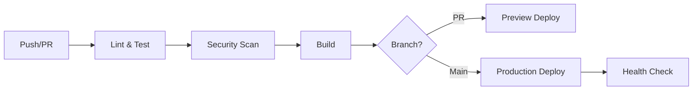

# 🚀 CI/CD Setup Guide

Esta guía explica cómo configurar y utilizar el pipeline de CI/CD para el
proyecto Gallery.

## 📋 Tabla de Contenidos

- [🏗️ Arquitectura del Pipeline](#🏗️-arquitectura-del-pipeline)
- [🔧 Configuración Inicial](#🔧-configuración-inicial)
- [🔑 Variables de Entorno](#🔑-variables-de-entorno)
- [🚀 Workflows](#🚀-workflows)
- [📊 Monitoreo y Reportes](#📊-monitoreo-y-reportes)
- [🛠️ Comandos Útiles](#🛠️-comandos-útiles)

## 🏗️ Arquitectura del Pipeline

El pipeline de CI/CD está diseñado con las siguientes etapas:



### 🧩 Componentes Principales

1. **🧪 Testing & Quality**: ESLint, TypeScript checks, Vitest
2. **🔒 Security**: CodeQL, Dependency review, Vulnerability scanning
3. **🏗️ Build**: Astro build con optimizaciones
4. **🚀 Deploy**: Netlify para preview y producción
5. **📊 Monitoring**: Lighthouse CI, Health checks

## 🔧 Configuración Inicial

### 1. Dependencias de Desarrollo

```bash
npm install --save-dev \
  @astrojs/check \
  @typescript-eslint/eslint-plugin \
  @typescript-eslint/parser \
  @vitest/ui \
  eslint \
  eslint-plugin-astro \
  eslint-plugin-jsx-a11y \
  jsdom \
  prettier \
  prettier-plugin-astro \
  typescript \
  vitest
```

### 2. Scripts de Package.json

```json
{
  "scripts": {
    "lint": "eslint . --ext .js,.ts,.astro --fix",
    "lint:check": "eslint . --ext .js,.ts,.astro",
    "format": "prettier --write .",
    "format:check": "prettier --check .",
    "type-check": "astro check",
    "test": "vitest",
    "test:coverage": "vitest --coverage"
  }
}
```

### 3. Archivos de Configuración

- **`.prettierrc.json`**: Configuración de formato de código
- **`eslint.config.js`**: Reglas de linting
- **`vitest.config.ts`**: Configuración de tests
- **`.lighthouserc.json`**: Configuración de performance

## 🔑 Variables de Entorno

### GitHub Secrets Requeridos

En la configuración del repositorio en GitHub
(`Settings > Secrets and variables > Actions`):

#### 🌩️ Cloudinary

```bash
CLOUDINARY_CLOUDNAME=tu_cloud_name
CLOUDINARY_APIKEY=tu_api_key
CLOUDINARY_APISECRET=tu_api_secret
```

#### 🌐 Netlify (Opcional)

```bash
NETLIFY_AUTH_TOKEN=tu_netlify_token
NETLIFY_SITE_ID=tu_site_id
```

#### 🔒 Security (Opcional)

```bash
SNYK_TOKEN=tu_snyk_token
```

### 🎯 Configuración en Netlify

1. **Build command**: `npm run build`
2. **Publish directory**: `dist`
3. **Environment variables**:
   - `CLOUDINARY_CLOUDNAME`
   - `CLOUDINARY_APIKEY`
   - `CLOUDINARY_APISECRET`

## 🚀 Workflows

### 1. 🔄 CI/CD Principal (`ci.yml`)

**Triggers**:

- Push a `main` o `develop`
- Pull requests a `main` o `develop`
- Ejecución manual

**Jobs**:

- **🧪 Test & Lint**: Validación de código y tests
- **🏗️ Build**: Construcción del proyecto
- **🔒 Security**: Escaneo de vulnerabilidades
- **📱 Preview Deploy**: Deploy de preview para PRs
- **🚀 Production Deploy**: Deploy a producción (solo main)

### 2. 🔍 Análisis de Seguridad (`codeql.yml`)

**Triggers**:

- Push y PRs
- Cron semanal (lunes 9:00 UTC)

**Funciones**:

- Análisis estático de código
- Detección de vulnerabilidades
- Reporte en Security tab

### 3. 📦 Revisión de Dependencias (`dependency-review.yml`)

**Triggers**:

- Pull requests

**Funciones**:

- Análisis de nuevas dependencias
- Verificación de licencias
- Actualización automática programada

### 4. 🏷️ Gestión de Releases (`release.yml`)

**Triggers**:

- Tags `v*`
- Ejecución manual

**Funciones**:

- Creación automática de releases
- Generación de changelog
- Deploy a producción

## 📊 Monitoreo y Reportes

### 🎯 Lighthouse CI

Métricas automáticas en cada deployment:

- **Performance**: > 80%
- **Accessibility**: > 90%
- **Best Practices**: > 80%
- **SEO**: > 90%

### 🔒 Seguridad

- **CodeQL**: Análisis semanal automático
- **Dependabot**: Updates automáticos de dependencias
- **Snyk**: Escaneo de vulnerabilidades

### 📈 Cobertura de Tests

Target de cobertura:

- **Branches**: 70%
- **Functions**: 70%
- **Lines**: 70%
- **Statements**: 70%

## 🛠️ Comandos Útiles

### 🏃‍♂️ Desarrollo Local

```bash
# Desarrollo
npm run dev

# Linting y formateo
npm run lint
npm run format

# Tests
npm run test
npm run test:watch
npm run test:coverage

# Type checking
npm run type-check

# Build local
npm run build
npm run preview
```

### 🔧 CI/CD Local

```bash
# Simular pipeline completo
npm run lint:check && \
npm run type-check && \
npm run test && \
npm run build

# Verificar formato
npm run format:check

# Limpiar build
npm run clean
```

### 🚀 Deploy Manual

```bash
# Crear release tag
git tag v1.0.0
git push origin v1.0.0

# O usar GitHub CLI
gh release create v1.0.0 --auto
```

## 🎯 Mejores Prácticas

### 🔀 Workflow de Branches

1. **Feature branches**: `feature/nombre-feature`
2. **Bugfix branches**: `bugfix/nombre-bug`
3. **Release branches**: `release/v1.0.0`
4. **Hotfix branches**: `hotfix/nombre-hotfix`

### ✅ Checklist antes de Push

- [ ] Tests pasan localmente
- [ ] Linting sin errores
- [ ] Type checking ok
- [ ] Build exitoso
- [ ] Commit messages descriptivos

### 🔄 Pull Request Process

1. Crear branch desde `main`
2. Implementar cambios
3. Ejecutar tests localmente
4. Push y crear PR
5. Review automático + manual
6. Merge después de aprobación

## 🚨 Troubleshooting

### ❌ Build Failures

```bash
# Verificar logs de GitHub Actions
# Ejecutar build localmente
npm run build

# Verificar variables de entorno
echo $CLOUDINARY_CLOUDNAME
```

### 🧪 Test Failures

```bash
# Ejecutar tests en modo verbose
npm run test -- --reporter=verbose

# Ejecutar test específico
npm run test -- --grep "nombre-test"
```

### 🔒 Security Issues

```bash
# Audit de npm
npm audit

# Fix automático
npm audit fix

# Análisis con Snyk
npx snyk test
```

## 📚 Referencias

- [GitHub Actions Documentation](https://docs.github.com/en/actions)
- [Astro Deployment Guide](https://docs.astro.build/en/guides/deploy/)
- [Netlify Deploy Settings](https://docs.netlify.com/configure-builds/overview/)
- [Lighthouse CI](https://github.com/GoogleChrome/lighthouse-ci)
- [CodeQL](https://codeql.github.com/docs/)
